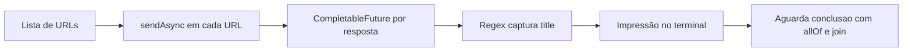

# FastScraper

<p align="center">
  <strong>Scraper assíncrono em Java para extrair títulos de páginas web com alta simplicidade.</strong>
</p>

<p align="center">
  
  
  
</p>

---

## Sobre o projeto

O `FastScraper` faz requisições HTTP em paralelo com `HttpClient.sendAsync`, processa as respostas com `CompletableFuture` e extrai o conteúdo da tag `<title>` de cada página.

Na configuração atual, ele consulta:

- `https://www.google.com`
- `https://www.github.com`

e imprime no terminal o par `URL + título`.

---

## Destaques

| Recurso | Descrição |
|---|---|
| Execução concorrente | Dispara múltiplas requisições ao mesmo tempo |
| Base moderna do Java | Usa `java.net.http.HttpClient` (Java 11+) |
| Simples para evoluir | Estrutura pequena e fácil de expandir |
| Sem dependências obrigatórias | O núcleo roda apenas com Java padrão |

---

## Stack técnica

- Java 17
- `java.net.http.HttpClient`
- `CompletableFuture`
- Regex para extração de `<title>`
- Maven (com `pom.xml` configurado para Java 17)

---

## Estrutura atual

```text
.
├── FastScraper.java
└── .vscode/pom.xml
```

---

## Como executar

### 1) Compilação direta (mais simples)

```bash
cd /home/axl/urss
javac FastScraper.java
java FastScraper
```

### 2) Usando Maven

Como o `pom.xml` está em `.vscode`, execute:

```bash
cd /home/axl/urss/.vscode
mvn -q compile
```

> Observação: para um layout Maven padrão, mova o `pom.xml` para a raiz e organize o código em `src/main/java`.

---

## Saída esperada

```text
Site: https://www.google.com | Título: Google
Site: https://www.github.com | Título: GitHub: Let’s build from here · GitHub
```

---

## Fluxo de execução



---

## Limitações conhecidas

- Regex para HTML é simples e pode falhar em páginas não convencionais.
- Não há tratamento detalhado por URL (timeout, DNS, SSL, status code).
- URLs estão fixas no método `main`.

---

## Roadmap sugerido

- Ler URLs por argumentos de linha de comando.
- Definir timeout e fallback por requisição.
- Substituir regex por parser HTML (ex.: Jsoup) para maior robustez.
